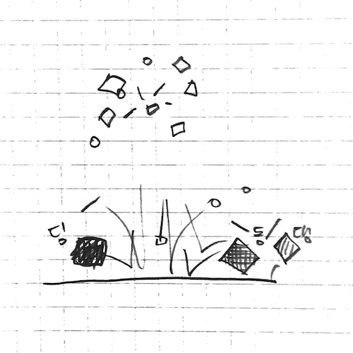

## 시작하기

접속 주소 : <http://picxenk.github.io/PoeticCodeForNature/>
 * picxenk 대신 여러분의 아이디로 변경합니다.
 * \_config.yml 파일에서 url 값을 여러분에게 맞게 수정하세요.
 * 원한다면 테마를 변경할 수 있습니다. <https://pages.github.com/themes/> 페이지를 참고합니다.
 * 여러분의 작업에 어울리는 테마 작업이 된다면 더 멋지겠죠?
 * 접속 주소는 상단에 노출하고, '시작하기'부분은 삭제해도 됩니다.

## 김승범
 * 각자의 소개를 멋지게 적어보세요.
 * 자신을 표현하는 이미지도 함께 붙여주세요.
 * 각자의 관심 분야나 작업의 방향성 등도 적어주면 좋겠습니다.

## 작업
----
### [예시 작업](./example/)

 * 여러분의 작업을 p5 기반으로 만들고 링크를 걸 수 있습니다.
 * 이미지를 추가해서 작업을 더 이해하기 쉽게 만들 수 있습니다.

----
### [쿵쿵짝쿵 공을 튕기네](./ex01/)
 
  * 쿵짝을 찍어내는 공

---
### [Box2D 예제](./boxes/)
 * 이거는 가장 기본 예제입니다.
