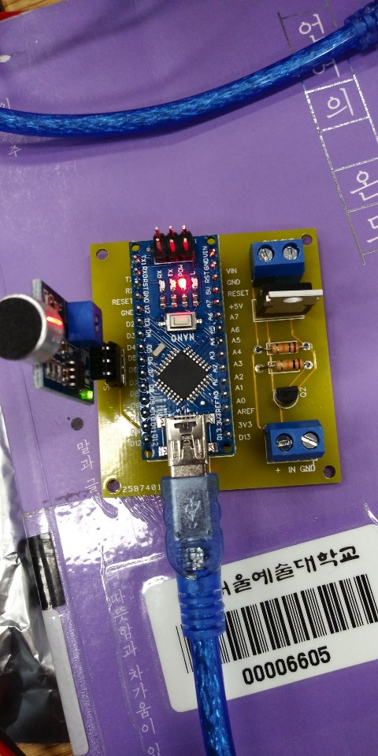
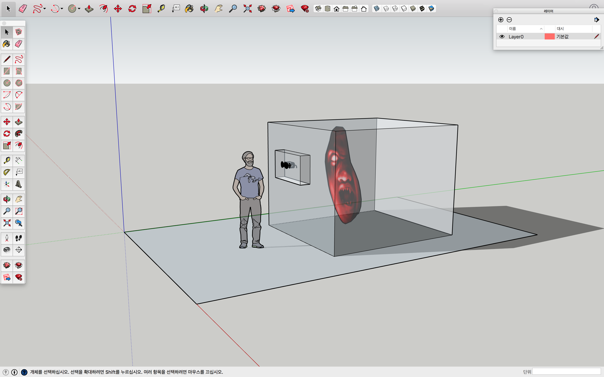
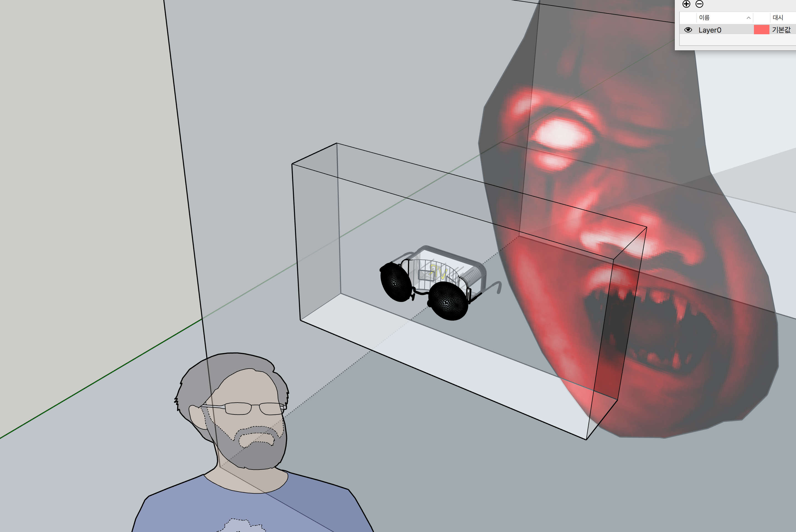
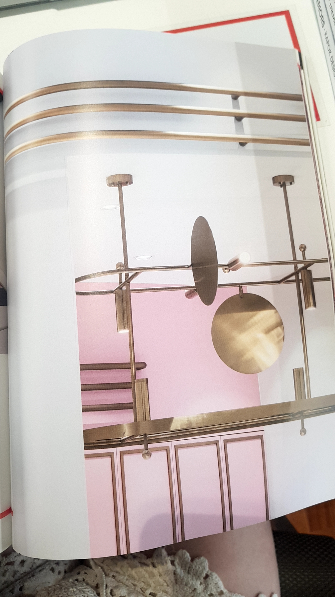
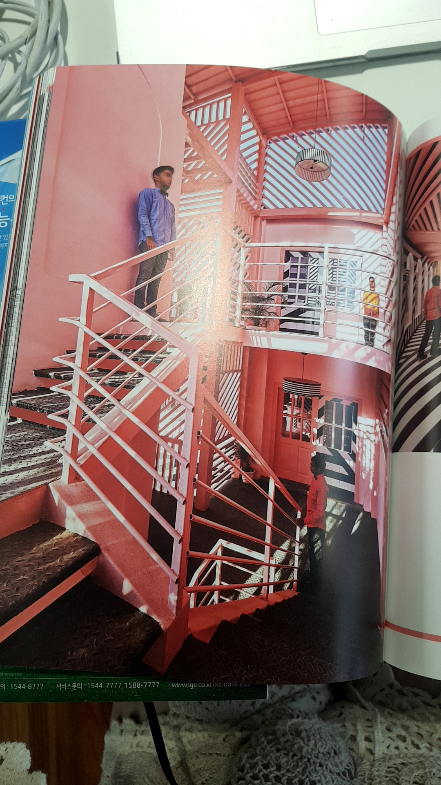

## 접속 주소
 : <http://midmost.github.io/PoeticCodeForNature/>

## Echec
only for Gentle Monster

---------

# Gentle Monster

### 예상 질문

- 왜 그렇게 젠틀몬스터에 집착하는지?

  : 왜냐하면 잘 할 수 있다고 확신하기 때문입니다.
    제 머릿속을 복사하여 뽑을 수만 있다면 누구든지 인정 하리라고 봅니다.
    이 회사가 표현하고자 하는 색깔이 제 능력과 합쳐졌을 때 큰 시너지를 만들 겁니다.
    조금씩 발전할 때 마다 다시금 지원하고 있습니다. 이번에는 떨어지자마자 발전된 것도 없이
    바로 지원을 하는 이유는 자소서를 다시 읽어보니 제가 이 회사에 끌린 이유는 적혀 있지만
    왜 제가 이 회사에 필요한지 명확하게 설명 되어있지 않다는 걸 깨달았습니다.
    그런 밑도 끝도 없는 자소서를 보고 면접 기회 주셔서 감사합니다...
    다시 본론으로 돌아와서, 단언컨데 현재 지원한 누구보다 잘 할 자신있습니다.
    얼렁뚱땅 붙으려는 패기가 아니라 진정으로 저는 저를 믿기 때문입니다.

    저는 자판기입니다.
    누군가가 어떤 부분을 이렇게 표현해줘 여기서 쓰일 기술과 재료는 이거야
    라고 했을 때 저는 가장 효율적인 결과를 뽑아낼 겁니다.
    제가 제공한 포트폴리오는 오롯이 젠틀몬스터만을 위해 제작된 작업물이 아닙니다.
    항상 상황을 고려하여 작업을 합니다. 그리고 해당 목적내에서 낼 수 있는
    효율적인 결과를 실현하길 잘합니다. 그러니 아마 제가 만든 것들과 저의 부족한 스킬 능력을 보고
    아니라고 판단하실 수 있습니다. 제가 당장 필요한 도구로는 썩 매력은 없으니까요.
    그러나 아직 저는 살면서 제가 가진 재능의 십분의 일도 활용을 하지 않았습니다.
    그랬는데도 굶지는 않고 있으니 제가 얼마나 더 무궁무진한지 궁금하지 않으십니까?  

    그렇게 자신있으면 공간디자인 예술쪽이나 더 관련된 분야로 대학을 왜 안 갔냐고 말씀하실 수 있지만
    저는 당시에 저를 펼치기에, 그리고 배움을 받기에 적절한 장소와 시기가
    아니라고 판단했습니다. 이런 종류의 알 수 없는 무언가를 만들 때 중요한 건
    왜 하려는지 그리고 어떻게 할 수 있는지가 중요하지
    배우거나 돈을 들인다고 가능한 부분이 아니라고 생각하기 때문입니다.

    제가 확신이 들 때 행동하고 싶었어요. 지금의 저는 확신합니다.
    지금은 보잘것없지만 제가 이 회사의 작업물을 더 매력적으로 바꾸는 하나의 도구로 쓰일 수 있다고
    확신합니다. 그게 오브제아트가 되었건 키네틱아트가 되었건 표현해야 하는 방향만 설정되면
    어떤 것이든 가능합니다.

- 지금 어떤 일을 하고 있나? 어떤 작업을 하고 있나?

  : 다방면으로 노력하고 있습니다. 외주와 레슨을 하고 있고 최근 들어 그림을 다시 시작했습니다.
    아무래도 눈에 보이는 뭔가가 있어야 설득력이 높아질 거 같기 때문입니다.
    추가로 영어 실력을 더 올리기 위해 토플 학원을 다니고 있습니다.
    코로나의 여파로 많은 대학들이 무료 온라인 강의를 더 많이 열었기 때문입니다.
    배울 것이 너무 많은데 다 영어라서 부지런히 영어 실력을 올리려 하고 있습니다.
    더불어 _네이딘 버크 해리스_ 라는 여자의 제자가 되고 싶어서 인 것도 있습니다.

    작업은 하고 있지 않습니다. 위에 말씀드렸듯이 저는 제가 하고 싶다고 막 하지 않습니다.
    적절한 시기를 기다립니다. 하지만 그렇다고 해서 제가 태어날 때 부터 갖고
    태어난 재능을 썩히고 싶지는 않기에 계속 이곳에 지원하고 있습니다.

    제가 하고 싶은 작업은 사람들이 만족해하는 무언가 입니다.
    어떤 형태인지는 중요치 않습니다.
    그렇기에 사람들이 좋아할 만한 요소는 계속적으로 공부하고 있습니다.
    공부를 하면 할수록 사람들이 듣도 보도 못했지만 매력을 느낄
    그 무언가를 만들 수 있음에 점점 확신이 생깁니다.

- 로봇팔 작업은 어떻게 하게 되었고 어디까지 다룰 수 있는지?

  : 매뉴얼만 있으면 뭐든지 할 수 있습니다. 생각보다 다루기 쉬웠습니다.
    아쉬운 점은 팀보이드에서 사용하는 기종은 라이브 인터랙션이 되는데 그런 기종이 아니라서 표현의 한계를
    느꼈던 점이 아쉽습니다. 역시 돈이 최고입니다.

- 3d 툴 작업한 거 볼 수 있나?
  : 포트폴리오에 올라가 있는 기어와 고래 모델링 및 리깅만 현재 가지고 있습니다.

- 아두이노로 작업한 다른 것들
  : 퀄리티가 그렇게 높지 않습니다. 대부분 아두이노 우노로 스케치 작업하다가 막판에 가서 다른 임베디드 보드를
    쓰거나 아두이노 나노를 이용한 pcb를 제작했습니다. 보통 2주내에 끝낼 수 있는
    최대한 쉽고 간단한 기술들을 이용하였습니다.
    

### 내가 하고 싶은 질문

- 오브제를 만드는 것에 있어서 어떤 규칙이 있는지
- 작업하는데 있어 가장 우선 순위로 생각해야 할 부분
- 믿고 거르는 인재상은...?
- 가장 인기가 좋았던 작업
- 모바일 앱에서 선글라스 자동 매치하여 판매하는 것에 대해서 어떻게 생각하는지

## 요즘 트렌드에 대한 내 생각
 아마존의 0.1세그먼트
 팬슈머 공략
 _업사이클_
 매장인앱 판매
 _쉬코노미_
 _카멜레존_
 후렌드

이 중에서 업사이클, 쉬코노미를 집중 공략하는 서비스가 필요하다고 느꼈습니다.
카멜레존은 이미 공간디자인으로 진행하고 있는 상태 하지만

* 서울 계동의 어니언
* 띵굴 스토어
* 성수연방
* 천상가옥
* 나우하우스
* 수트서플라이

이러한 마케팅을 하는 그룹이 점차 늘고 있기에 조심스럽네요.
이러한 카멜레존에서 가장 필요한 전략은 독보적인 컨셉과 더불어 _공동성장_ 이 필요하다고 느낍니다.

인공지능, 가상현실과 함께 바뀌어 가는 사회 추세에서 젠틀몬스터같은 업체는
Augmented Human 을 가장 중점적으로 살펴야 할 기업이라고 생각합니다.
그와 더불어
Sensing and Mobility가 합쳐진다면 더(내가 생각하기엔 인터랙션)이 필요하지 않을까 싶습니다.

## 좋아하는 작가와 작품
 _미디어 아트 - 설치:_
* [Random International](https://vimeo.com/376351028)
* [Lab212](https://lab212.org/oeuvres/2:art/17/Portee)
* [김윤철](https://youtu.be/geypSqyGZ0Y)
* [팀보이드]()  

 _미디어 아트 - 디지털 아트:_

 * [Robert Henke](https://youtu.be/zMHb5ft_P6Q)
 * [Robert Henke](https://youtu.be/WrVsj3xN3E4)  
 * [남궁원](https://youtu.be/JvH0ukNCYeo)

 _독보적인 특색 가진 설치미술 작가_

 * [이불](https://youtu.be/WhyeyI3fKY8)
 * [Janet Echelman](https://youtu.be/l3rIW9nJw3Y)
    * [Hans Haacke](https://youtu.be/tOmesd5aHIk)
    * [Hans Haacke at Paula Cooper, New York (Jan 2008)](https://youtu.be/ffpvKOm2WIE)
    * [Vija Celmins](https://www.sfmoma.org/watch/vija-celmins-saying-the-unsayable/)
    * [Matthew Ronay](https://youtu.be/CXapwtxencw)
    * [Tomás Saraceno](https://youtu.be/05rgQUFPTjc)
    * [joana vasconcelos]
    

     <!-- 
      -->
     
     
     
     

- 내가 생각한 쇼윈도 전시

     
     
     

     
     
     
     
     
     

     
       

     
     
     
     
     

## 좋아하는 공간

### 내가 좋아했지만 한 물 간 듯 한 디자인

